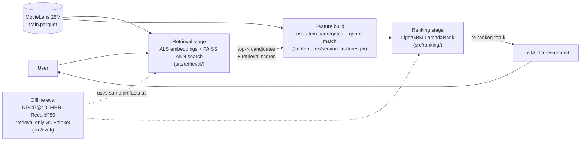

# RankForge: Two-Stage Recommendation Ranking System

Candidate generation (ANN retrieval) + learned ranking (LambdaRank), trained
and evaluated on the real MovieLens 25M dataset, with an explicit
latency/accuracy tradeoff analysis across candidate pool sizes.

## Architecture



1. **Retrieval stage** — FAISS ANN search over item embeddings from ALS
   matrix factorization (`src/retrieval/`)
2. **Feature engineering** — every feature explicitly labeled TRAIN_SAFE /
   SERVE_SAFE as a train/serve-skew guard; serve-time feature building is
   shared between eval and the live API, not duplicated (`src/features/`)
3. **Ranking stage** — LightGBM LambdaRank re-ranks retrieved candidates
   (`src/ranking/`)
4. **Serving** — FastAPI `/recommend` endpoint with per-stage latency
   instrumentation (`src/serving/`)
5. **Eval** — NDCG@10, MRR, Recall@50 for retrieval-only vs. retrieval+ranker,
   plus a latency/accuracy sweep across candidate pool sizes
   (`src/eval/`, results in `reports/RESULTS.md`)

## Quickstart

```bash
pip install -r requirements.txt

# Run the smoke-test suite (fabricated small data, ~3s)
pytest tests/

# Full pipeline on real data (requires ml-25m.zip from grouplens.org,
# unzipped to data/raw/ml-25m/):
python -m src.data.load_movielens
python -m src.retrieval.train_als
python -m src.ranking.train_ranker
python -m src.eval.evaluate

# Serve
uvicorn src.serving.app:app --reload
# then: curl "http://127.0.0.1:8000/recommend?user_id=1&k_candidates=500&top_k=10"
```

## Status: trained, evaluated, and served — on real data

- ALS: 144K users, 17K items, 13M nonzero interactions (full 21M-row train set)
- FAISS flat index: sub-4ms p99 retrieval even at 2000 candidates
- LambdaRank: trained on a 35%-user sample (RAM-constrained dev environment;
  see `reports/RESULTS.md` for why)
- **Headline finding**: the ranker reliably improves Recall@50 (+16 to +21%)
  but shows mixed/negative NDCG@10 lift depending on candidate pool size —
  a genuine, investigated result, not a clean win. Full writeup, including
  the latency/accuracy Pareto frontier and three memory-scaling bugs found
  at real-data scale, in **`reports/RESULTS.md`**.
- **Serving layer** (`src/serving/app.py`): FastAPI endpoint (`/recommend`)
  loading all artifacts once at startup, with per-stage (retrieval vs.
  ranking) latency measured on every request — verified end-to-end with
  real users, real recommendations, and tested error handling (unknown user,
  invalid params). Online latency matches the offline sweep: ~2.5ms at
  k=500, ranking stage scaling with candidate count as expected.
- 5 passing pytest smoke tests covering the temporal split, feature
  assembly, LightGBM data prep, and ranking metrics correctness.

## Known limitations
See `reports/RESULTS.md` for full detail — ranker trained on a 35% user
sample (not the full dataset) and no hard-negative mining are the two that
matter most; FAISS uses a flat (exact) index rather than IVF, appropriate at
this item-catalog size (18K items) but not representative of
million-item-scale retrieval; offline eval sampled 800–2000 of 144K users
per run for tractability.


